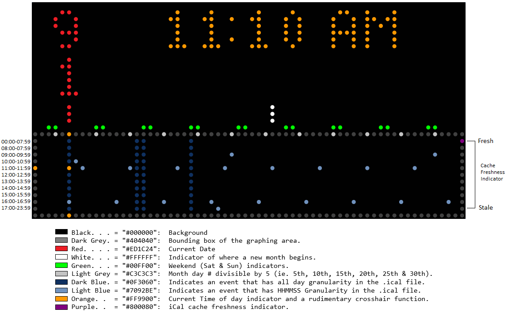

# Calendar Visualizer for TronByt

Concept: Ctrl-G

Created by: Ctrl-G & Google's Gemini (Flash 3.6 - I think, although it might have been upgraded during this development).

Summary: Calendar Visualization App

Description: Displays a very dense visualization of events from a Google Calendar iCal URL.  Probably only helpful for
persons who don't have a lot of closely spaced events in their Google Calendar.  This was produced because I always wanted
to see the spatial relationship between the current time and my next 'event / meeting'.

The calendar graphing area shows 62 days, one day for each vertical column of LEDs.  Each dot in the vertical column indicates the following time:

<i>Calendar Visualizer - No animation</i>

Future expansion:

        *.  Blinking colon of the clock.
        
        *.  Blinking current time dot (Done and optional!) on event graph display possibly
            to coincide with blinking colon of the clock (which is currently not blinking).
            The event graph display dot to reveal of the item under the dot, if any, when
            the dot is off.

        *.  Color entry for each of the hard coded color entries above.  This to be
            superseded by ...

        *.  Calendar Notes field Color keys for calviz use, like: "CalViz:Color:#EA3FF7"
            which will then make the event show up in Fuchsia (if #EA3FF7 is Fuchsia).
            I believe this would be a good color for important events and in particular
            important events with are critical but that you don't really want to do.  You
            might also like to use #22B14C for Financial events, for instance.

