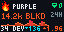
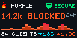

# Firewalla Network

Displays an overview of your Firewalla network security and activity on Tronbyt / Tidbyt displays.

## Features

- **Device Name & Alarm Badge:** Displays your Firewalla device name and security alert badge.
- **Hero Threat Metric:** 24-hour blocked threat tally.
- **Sparkline Activity Graph:** 24-hour trend sparkline showing blocked flow history.
- **Network Metrics Footer:** Active client count with download/upload bandwidth indicators.
- **Customizable Footer Display:** Choose between Clients & Traffic, Clients & Total 24h Data, or Clients Only.
- **Native 2x Display Support:** High-resolution 128×64 layout for Tronbyt Gen 2.
- **Dual Connection Modes:** Connect either locally via LAN/Docker bridge or remotely via Firewalla Cloud MSP.

## Connection Modes

### Mode 1: Local Bridge (Docker / LAN)
*Default mode — no paid MSP subscription required.*
Works with **MSP Lite** and standalone Firewalla boxes (Gold, Purple, Red).

1. In the app settings, set **Connection Mode** to `Local Bridge (Docker / LAN)`.
2. Enter your bridge address in **Bridge Address** (e.g. `http://192.168.1.15:7153`).
3. Leave **API Token** blank.

### Mode 2: Firewalla Cloud MSP
For users with an official Firewalla MSP cloud subscription.

1. Set **Connection Mode** to `Firewalla Cloud MSP (Paid Plan)`.
2. In **Cloud MSP Domain**, enter your MSP domain (e.g. `yoursubdomain.firewalla.net`).
3. In **API Token**, enter your Personal Access Token created in your Firewalla MSP account settings.

## Local Bridge Companion

If you don't have a paid Firewalla MSP Cloud subscription, you can run the open-source **[firewalla-tronbyt-bridge](https://github.com/brombomb/firewalla-tronbyt-bridge)** container on your local network (Docker, Unraid, Synology, Raspberry Pi, etc.).

* **How it works:** Firewalla boxes provide a local API on port `8833` via the Extended Token Pairing (ETP) protocol. The bridge utilizes the [`node-firewalla`](https://www.npmjs.com/package/node-firewalla) npm package to communicate with your box locally and serves clean REST endpoints on port `7153` for your Tronbyt device.
* **Compatibility:** Works with **MSP Lite** and standalone boxes (Purple, Gold, Red).
* **Setup Guide:** See the [firewalla-tronbyt-bridge repository](https://github.com/brombomb/firewalla-tronbyt-bridge) for quick setup, one-time pairing instructions, and `docker-compose.yml`.
